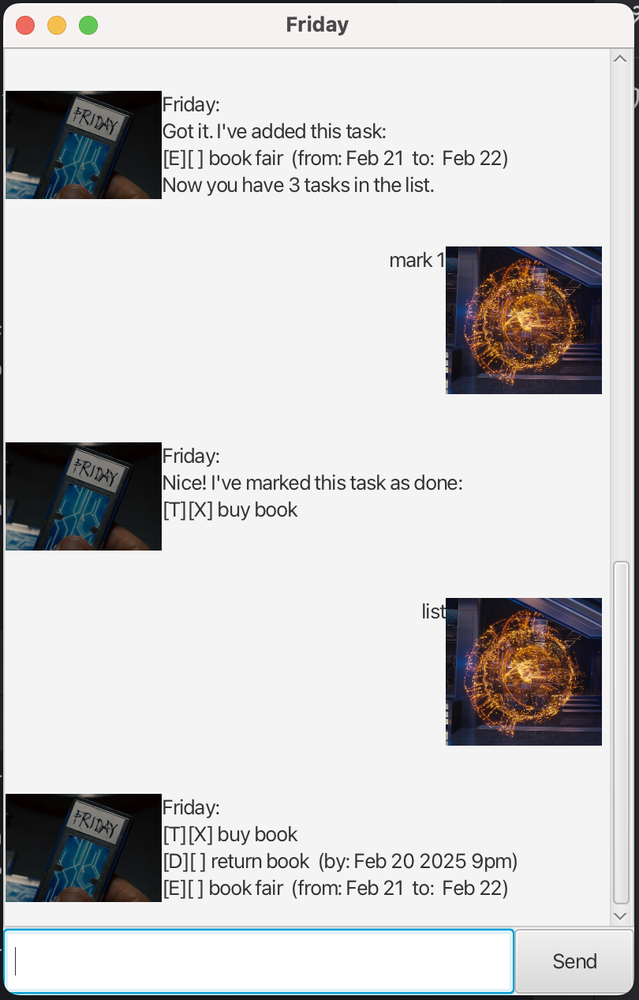

# Friday User Guide



Friday is your personal AI butler who helps you take note of all your upcoming tasks.

## Adding Todo Tasks
> format: **todo** ***description***

Example: `todo buy book`

Friday will add your todo task into the TaskList and respond as such: 
```
Got it. I've added this task:
[T][ ] buy book
Now you have 1 tasks in the list.
```
## Adding DeadLine Tasks
> format: **deadline** ***description*** **/by** ***date&time***

Example: `deadline return book /by 2025-2-20 2200`

Friday will add your deadline task into the TaskList and respond as such:
```
Got it. I've added this task:
[D][ ] return book (by Feb 20 2025 10pm)
Now you have 2 tasks in the list.
```

## Adding Event Tasks
> format: **event** ***description*** **/from** ***StartDate*** **/to** ***EndDate***

Example: `event book fair /from Feb 22 /to Feb 24`

Friday will add your event task into the TaskList and respond as such:
```
Got it. I've added this task:
[E][ ] book fair (from: Feb 22 to: Feb 24)
Now you have 3 tasks in the list.
```

## Listing All Tasks
> format: **list**

Example: `list`

Friday will list out all of your tasks as such:
```
[T][ ] buy book
[D][ ] return book (by: Feb 20 2025 10pm)
[E][ ] book fair (from: Feb 22 to: Feb 24)
```

## Marking Tasks
> format: **mark** ***index***

Example: `mark 1`

Friday will mark the specified task as completed and respond as such:
```
Nice! I've marked this task as done:
[T][X] buy book
```
## Unmarking Tasks
> format: **unmark** ***index***

Example: `unmark 1`

Friday will unmark the specified task  and respond as such:
```
OK, I've marked this task as not done yet:
[T][ ] buy book
```

## Deleting Tasks
> format: **delete** ***index***

Example: `delete 1`

Friday will delete the specified task and respond as such:
```
Noted. I've removed this task:
[T][ ] buy book
Now you have 2 tasks in the list.
```

## Finding Tasks
> format: **find** ***text***

Example: `find return`

Friday will list out all of your tasks that contain the specified text:
```
[D][ ] return book (by: Feb 20 2025 10pm)
```

## Prioritising Tasks
> format: **prioritise** ***index*** ***priority***

Example: `prioritise 1 high`

Friday will prioritise the specified task as the specified priority:
```
Prioritised [D][ ] return book (by: Feb 20 2025 10pm) as high
```

## Listing Prioritised Tasks
> format: **plist** ***priority***

Example: `plist high`

Friday will list out all of your tasks that is of the specified priority:
```
[D][ ] return book (by: Feb 20 2025 10pm)
```

## Bye
> format: **bye**

Example: `bye`

Friday will save the task into a taskList file located on the user's desktop, before bidding farewell:
```
Bye. Hope to see you again soon!
```